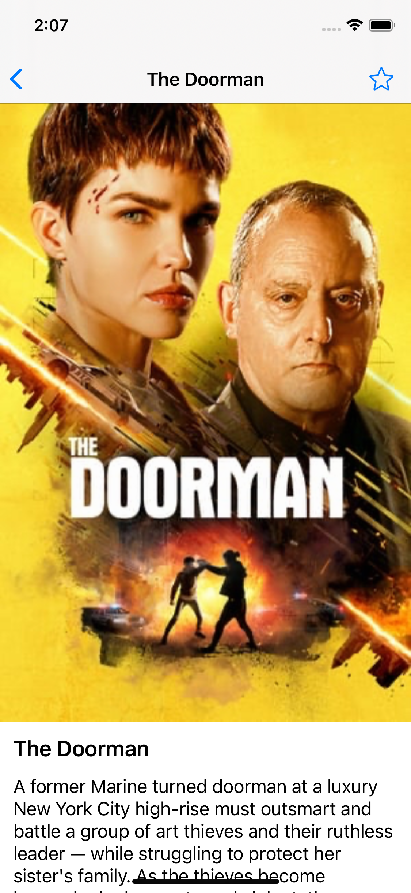

# cinea
Sample iOS App on top of TheMovieDB Api

Run "pod install" on command line to run the app.
Only pod used is KingFisher

Features;
- UICollectionView with pagination to list movies
- Advanced search panel
- Movie details page with parallax effect
- Favourite movies storage
- Dark mode compatible
- Backwards compatible to iOS 9 (needs a little bit adjustments)
- Pixel perfect ui

